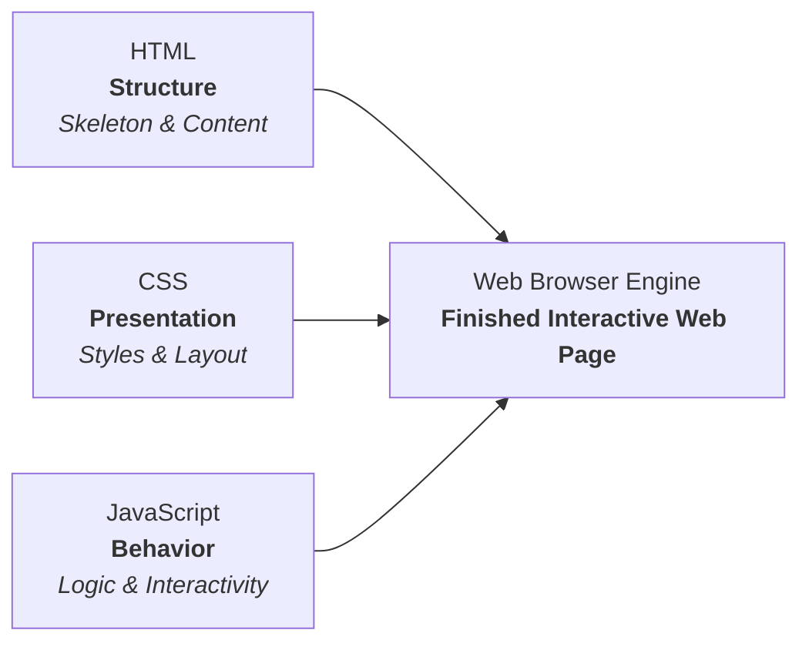
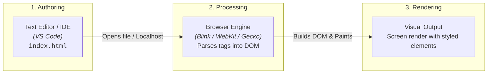
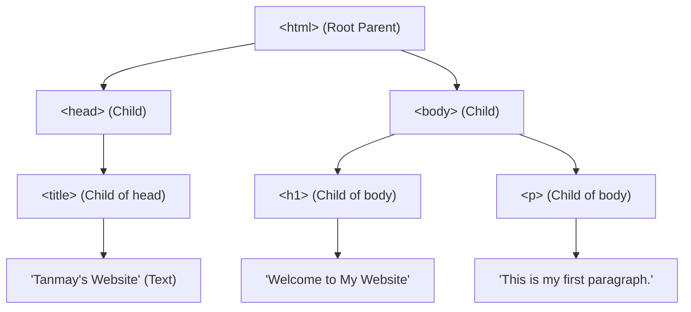

# Chapter 1: Hello to HTML 🌐

[](https://developer.mozilla.org/en-US/docs/Web/HTML)
[](https://developer.mozilla.org/en-US/docs/Web/CSS)
[](https://developer.mozilla.org/en-US/docs/Web/JavaScript)
[](https://code.visualstudio.com/)
[](https://developer.chrome.com/docs/devtools/)

> **Welcome to Web Development!**  
> An absolute beginner's foundation guide to **HTML (HyperText Markup Language)** — understanding how the web works, mastering core document structure, exploring parent-child DOM trees, and writing your very first web page.

---

## 📑 Table of Contents
1. [What is HTML?](#what-is-html)
2. [The Web Development Trifecta (HTML vs. CSS vs. JavaScript)](#the-web-development-trifecta)
3. [Why is `index.html` Special?](#why-is-indexhtml-special)
4. [How the Web Works: Workflow Pipeline](#how-the-web-works-workflow-pipeline)
5. [Anatomy of an HTML Document](#anatomy-of-an-html-document)
6. [HTML Document Tree (DOM Hierarchy)](#html-document-tree-dom-hierarchy)
7. [Element Types: Container vs. Empty (Void) Elements](#element-types-container-vs-empty-void-elements)
8. [The Modern HTML5 Boilerplate (`!`)](#the-modern-html5-boilerplate-)
9. [HTML Comments](#html-comments)
10. [Case Sensitivity & Industry Standards](#case-sensitivity--industry-standards)
11. [Inspecting Websites (Developer Tools)](#inspecting-websites-developer-tools)
12. [Summary Cheatsheet & Key Takeaways](#summary-cheatsheet--key-takeaways)

---

## 1. What is HTML?

**HTML** stands for **HyperText Markup Language**:
- **HyperText**: Text that contains links (hyperlinks) connecting web pages to one another across the internet.
- **Markup**: The system of annotating documents with tags (e.g., `<h1>`, `<p>`, `<a>`) to define structure and semantics.
- **Language**: A standardized syntax understood by all web browsers worldwide.

HTML is **not a programming language**—it has no variables, functions, or algorithmic loops. Instead, it is the **structural backbone (skeleton)** of every website on the Internet.

---

## 2. The Web Development Trifecta

A modern web application is built on three complementary core technologies:

| Layer | Technology | Primary Role | Human Body Analogy | House Analogy |
| :--- | :--- | :--- | :--- | :--- |
| **Structure** | **HTML** | Content layout, headings, paragraphs, forms, links | **Skeleton** | Foundation, bricks & wooden framing |
| **Presentation** | **CSS** | Styling, colors, typography, margins, Flexbox/Grid | **Skin, clothes & styling** | Paint, wallpaper & interior decor |
| **Behavior** | **JavaScript** | Interactivity, dynamic UI, API calls, event handlers | **Muscles & brain** | Electricity, plumbing & smart locks |



---

## 3. Why is `index.html` Special?

Whenever a web server receives a request for a folder or the root URL of a domain (e.g., `https://example.com/`), it automatically looks for a default file to serve.

By universal convention across almost all web servers (Apache, Nginx, GitHub Pages, Firebase Hosting, Vercel), **`index.html`** is that default entry point. 

- If your file is named `index.html`, users can visit `https://mysite.com/` without typing `https://mysite.com/index.html`.
- Any other page (e.g., `about.html`, `contact.html`) requires the explicit path in the URL.

---

## 4. How the Web Works: Workflow Pipeline

From writing code on your computer to seeing it rendered in the browser:



1. **Text Editor**: You write markup using a code editor (like VS Code).
2. **Web Browser**: The browser reads the raw text, parses opening and closing tags, and builds the internal **Document Object Model (DOM)** tree.
3. **Screen Output**: The browser paints text, images, and layout onto the user's display.

---

## 5. Anatomy of an HTML Document

Here is our first basic HTML document:

```html
<!DOCTYPE html>
<html>
    <head>
        <title>Tanmay's Website</title>
    </head>
    <body>
        <h1>Welcome to My Website</h1>
        <p>This is my first paragraph.</p>
    </body>
</html>
```

### Line-by-Line Breakdown

| Code Fragment | Purpose & Meaning |
| :--- | :--- |
| `<!DOCTYPE html>` | Tells the browser this file uses the **HTML5** standard. Ensures the browser renders in standards mode rather than "quirks mode". |
| `<html> ... </html>` | The **root element** of the entire document. All other tags reside inside this container. |
| `<head> ... </head>` | The container for **metadata** (data about data). Information here is not directly rendered on the main page canvas (e.g., character set, page title, linked stylesheets, scripts). |
| `<title> ... </title>` | Specifies the title displayed on the **browser tab** and used by search engines in search results. |
| `<body> ... </body>` | Contains all the **visible content** rendered inside the browser window (headings, text, buttons, images, videos). |
| `<h1> ... </h1>` | Top-level **heading** tag. Used for the primary title or most important heading on a page. |
| `<p> ... </p>` | A **paragraph** tag. Automatically adds default vertical spacing above and below chunks of text. |

> [!NOTE]
> In semantic HTML, a `<p>` tag should **not** be nested inside an `<h1>` tag. Headings (`<h1>`–`<h6>`) and paragraphs (`<p>`) are separate block-level sibling elements.

---

## 6. HTML Document Tree (DOM Hierarchy)

HTML documents follow a strict **hierarchical parent-child relationship**:



- **Parent**: An element that encloses other elements (e.g., `<html>` is the parent of `<head>` and `<body>`).
- **Child**: An element located directly inside another element (e.g., `<title>` is a child of `<head>`).
- **Siblings**: Elements that share the same parent (e.g., `<head>` and `<body>` are siblings; `<h1>` and `<p>` are siblings).

---

## 7. Element Types: Container vs. Empty (Void) Elements

HTML elements generally fall into two broad structural categories:

```mermaid
classDiagram
    class HTMLElement {
    }
    class ContainerElement {
        +Opening tag: <tag>
        +Content in between
        +Closing tag: </tag>
        Examples: <p>, <h1>, <div>, <span>
    }
    class EmptyVoidElement {
        +Self-contained tag
        +No content inside
        +No separate closing tag
        Examples: <br>, <hr>, <img>, <meta>, <input>
    }
    HTMLElement <|-- ContainerElement
    HTMLElement <|-- EmptyVoidElement
```



### 1. Normal (Container) Elements
Contain opening tags, content, and closing tags:
```html
<p>This is content wrapped between opening and closing tags.</p>
<!-- ^^^ Opening Tag    ^^^^ Content                           ^^^ Closing Tag -->
```

### 2. Empty (Void / Self-Closing) Elements
Do not wrap around text content or contain child tags. They do not have a closing `</tag>`:
- `<br>` : Inserts a single line break.
- `<hr>` : Inserts a thematic horizontal rule (divider line).
- `` : Embeds an image.
- `<input>` : Form input field.
- `<meta>` : Document metadata.

*(Note: In HTML5, writing `<br>` or `<br />` are both valid, but `<br>` is the standard modern syntax).*

---

## 8. The Modern HTML5 Boilerplate (`!`)

When starting any new HTML file in editors like **VS Code**, you can generate standard boilerplate scaffolding instantly using **Emmet**:
1. Create a file ending with `.html`.
2. Type `!` (exclamation mark).
3. Press `Tab` or `Enter`.

```html
<!DOCTYPE html>
<html lang="en">
<head>
    <meta charset="UTF-8">
    <meta name="viewport" content="width=device-width, initial-scale=1.0">
    <title>Document</title>
</head>
<body>
    THIS IS MY FIRST WEBSITE!
</body>
</html>
```

### Key Boilerplate Attributes & Tags

- **`lang="en"`**: Declares the primary language of the webpage (English) to assistive screen readers, spell-checkers, and translation engines.
- **`<meta charset="UTF-8">`**: Specifies the character encoding format. `UTF-8` covers almost all characters, symbols, and emojis across all languages.
- **`<meta name="viewport" content="width=device-width, initial-scale=1.0">`**: Ensures the page scales correctly on mobile devices and responsive screen sizes:
  - `width=device-width`: Matches the screen's width in device-independent pixels.
  - `initial-scale=1.0`: Sets the default 100% zoom level when the page first loads.

---

## 9. HTML Comments

Comments allow developers to leave notes, explanations, or temporarily disable code without affecting how the page renders.

```html
<!-- This is a single-line comment -->

<!-- 
    This is a multi-line comment.
    Browsers ignore anything written here.
    It will NOT show up on the rendered web page!
-->
```

- **Syntax**: Begins with `<!--` and ends with `-->`.
- **Keyboard Shortcut (VS Code)**: `Cmd + /` (macOS) or `Ctrl + /` (Windows/Linux).
- **Security Reminder**: Even though comments do not display on the rendered page, they are still visible to anyone who uses **"View Page Source"**. Never put passwords, API keys, or private sensitive info inside HTML comments!

---

## 10. Case Sensitivity & Industry Standards

HTML is **case-insensitive**:
```html
<H1>Heading</H1> <!-- Valid, will render -->
<h1>Heading</h1> <!-- Valid, recommended standard -->
```

Both work identically in web browsers. However:
> [!IMPORTANT]
> **Universal Best Practice**: Always write tags, attributes, and file names in **all lowercase** (`<h1>`, `class="btn"`, `index.html`). Lowercase markup conforms to the W3C standards, ensures cross-system compatibility (especially on case-sensitive Linux servers), and makes code cleaner to maintain.

### Valid File Extensions
You can use either `.html` or `.htm`. Modern development overwhelmingly standardizes on **`.html`**.

---

## 11. Inspecting Websites (Developer Tools)

Every modern web browser comes built-in with powerful developer tools that allow you to inspect, modify, and debug any website's HTML and CSS in real time:

| Action | macOS Shortcut | Windows / Linux Shortcut | Context Menu |
| :--- | :--- | :--- | :--- |
| **Inspect Element** | `Cmd + Option + I` (or `Cmd + Option + C`) | `Ctrl + Shift + I` (or `Ctrl + Shift + C`) | Right-click anywhere $\rightarrow$ **Inspect** |
| **View Page Source** | `Cmd + Option + U` | `Ctrl + U` | Right-click anywhere $\rightarrow$ **View Page Source** |

- **Inspect**: Opens Chrome DevTools showing the live, dynamic DOM tree. Any live edits you make here are instant (great for experimentation), but temporary.
- **View Source**: Shows the raw HTML document sent directly from the server.

---

## 12. Summary Cheatsheet & Key Takeaways

```
┌──────────────────────── HTML BASICS CHEATSHEET ────────────────────────┐
│                                                                        │
│  • HTML        : HyperText Markup Language (Skeleton / Structure)       │
│  • CSS         : Cascading Style Sheets (Design / Presentation)        │
│  • JS          : JavaScript (Logic / Dynamic Functionality)            │
│  • index.html  : Universal default root entry file for web servers     │
│  • <!DOCTYPE>  : Declares modern HTML5 standard                        │
│  • DOM Tree    : html > head & body (Strict parent-child hierarchy)    │
│  • Boilerplate : Press ! + Tab in VS Code                              │
│  • Comments    : <!-- comment text --> (Cmd+/ or Ctrl+/)               │
│  • Case Rule   : HTML is case-insensitive, but always use lowercase    │
│                                                                        │
└────────────────────────────────────────────────────────────────────────┘
```

### Next Steps (What to Learn Next)
1. **Semantic Text Formatting**: `<h2>` to `<h6>`, `<strong>`, `<em>`, `<blockquote>`, `<mark>`
2. **Lists**: Unordered (`<ul>`), Ordered (`<ol>`), and List Items (`<li>`)
3. **Links & Navigation**: Anchor tags (`<a href="...">`)
4. **Media Elements**: Images (``), Audio, and Video
5. **Tables & Forms**: User input handling with `<form>`, `<input>`, and `<button>`
