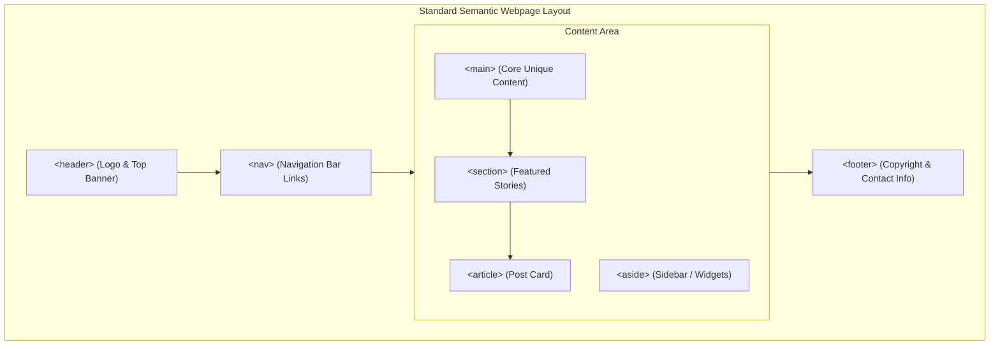

<p align="center">
  <a href="https://developer.mozilla.org/en-US/docs/Web/HTML">
    
  </a>
</p>

<p align="center">
  
</p>

<p align="center">
  
</p>

<h1 align="center">🌐 &lt;HTML&gt; PROGRAMMING 🚀</h1>

<p align="center">
  <strong>The Ultimate Beginner-to-Pro Learning Repository for Modern HTML5 & Web Development</strong><br>
  <em>From Barebone Tags and Semantic Layouts to High-Performance Forms, SEO Mastery, and Full Capstone Projects!</em>
</p>

---

## 🧭 Repository Navigation Hub

| Module | Core Topics & Focus Areas | Included Files | Level | Quick Access |
| :--- | :--- | :--- | :---: | :---: |
| 🚀 **[CH-1-Basic](./CH-1-Basic/)** | Document Skeleton, DOCTYPE, DOM Tree, Emmet `!`, Chrome DevTools | [`index.html`](./CH-1-Basic/index.html) • [`README.md`](./CH-1-Basic/README.md) | `Beginner` | [**Explore Chapter ➔**](./CH-1-Basic/) |
| 🏷️ **[CH-2-Tags](./CH-2-Tags/)** | Headings `<h1>-<h6>`, Text Formatting, Lists (`ol`, `ul`), Links `<a>`, Media `` | [`index.html`](./CH-2-Tags/index.html) • [`README.md`](./CH-2-Tags/README.md) | `Beginner` | [**Explore Chapter ➔**](./CH-2-Tags/) |
| 📐 **[CH-3-Layout](./CH-3-Layout/)** | Semantic Architecture (`header`, `main`, `nav`, `footer`), Block vs Inline, Multi-page Routing | [`index.html`](./CH-3-Layout/index.html) • [`info.html`](./CH-3-Layout/info.html) • [`README.md`](./CH-3-Layout/README.md) | `Intermediate` | [**Explore Chapter ➔**](./CH-3-Layout/) |
| 📝 **[CH-4-Forms](./CH-4-Forms/)** | Interactive Form Controls, Validation, `label`, Textarea, Dropdowns, GET/POST | [`index.html`](./CH-4-Forms/index.html) • [`info.html`](./CH-4-Forms/info.html) • [`README.md`](./CH-4-Forms/README.md) | `Intermediate` | [**Explore Chapter ➔**](./CH-4-Forms/) |
| 🔍 **[CH-5-SEO](./CH-5-SEO/)** | Meta Tags, Open Graph Previews, Googlebot Crawling, Hierarchy, Accessibility (A11y) | [`SEO.html`](./CH-5-SEO/SEO.html) • [`README.md`](./CH-5-SEO/README.md) | `Advanced` | [**Explore Chapter ➔**](./CH-5-SEO/) |
| 🏆 **[PROJECT 1](./PROJECT%201/)** | Full Real-World Responsive Web App combining HTML5 Structure, CSS3 & JavaScript | [`css/`](./PROJECT%201/css/) • [`js/`](./PROJECT%201/js/) • [`index.html`](./PROJECT%201/index.html) • [`README.md`](./PROJECT%201/README.md) | `Capstone` | [**Launch Project ➔**](./PROJECT%201/) |

<details>
<summary><b>📂 Quick Jump Directory Index (Click to Expand)</b></summary>

<br>

| Folder | Direct Links | Purpose |
| :--- | :--- | :--- |
| **`CH-1-Basic/`** | [📁 Folder](./CH-1-Basic/) • [📄 index.html](./CH-1-Basic/index.html) • [📘 Notes](./CH-1-Basic/README.md) | HTML5 Foundations & Hello World |
| **`CH-2-Tags/`** | [📁 Folder](./CH-2-Tags/) • [📄 index.html](./CH-2-Tags/index.html) • [📘 Notes](./CH-2-Tags/README.md) | Tag Vocabulary & Typography |
| **`CH-3-Layout/`** | [📁 Folder](./CH-3-Layout/) • [📄 index.html](./CH-3-Layout/index.html) • [📄 info.html](./CH-3-Layout/info.html) • [📘 Notes](./CH-3-Layout/README.md) | Semantic Architecture & Multi-Page |
| **`CH-4-Forms/`** | [📁 Folder](./CH-4-Forms/) • [📄 index.html](./CH-4-Forms/index.html) • [📄 info.html](./CH-4-Forms/info.html) • [📘 Notes](./CH-4-Forms/README.md) | User Input, Controls & Validation |
| **`CH-5-SEO/`** | [📁 Folder](./CH-5-SEO/) • [📄 SEO.html](./CH-5-SEO/SEO.html) • [📘 Notes](./CH-5-SEO/README.md) | Search Engine Optimization & A11y |
| **`PROJECT 1/`** | [📁 Folder](./PROJECT%201/) • [🎨 CSS](./PROJECT%201/css/) • [⚡ JS](./PROJECT%201/js/) • [📄 index.html](./PROJECT%201/index.html) • [📘 Notes](./PROJECT%201/README.md) | Complete Capstone Web Application |

</details>

---

## 🗺️ Learning Roadmap & Progression

```mermaid
flowchart LR
    C1["<b>CH-1: Basics</b><br>• Skeleton & DOCTYPE<br>• DOM Tree Hierarchy<br>• Emmet Boilerplate"] --> C2["<b>CH-2: Tags</b><br>• Formatting & Lists<br>• Hyperlinks & Media<br>• Void Elements"]
    C2 --> C3["<b>CH-3: Layout</b><br>• Semantic Structure<br>• header, main, nav<br>• Multi-page Routing"]
    C3 --> C4["<b>CH-4: Forms</b><br>• Inputs & Validation<br>• Selects & Textareas<br>• GET / POST Methods"]
    C4 --> C5["<b>CH-5: SEO</b><br>• Meta Tags & OpenGraph<br>• Search Engine Indexing<br>• Accessibility (A11y)"]
    C5 --> P1["<b>PROJECT 1</b><br>• Full Web App<br>• HTML5 + CSS3 + JS<br>• Production Ready!"]

    style C1 fill:#f97316,stroke:#ea580c,color:#fff
    style C2 fill:#3b82f6,stroke:#2563eb,color:#fff
    style C3 fill:#8b5cf6,stroke:#7c3aed,color:#fff
    style C4 fill:#10b981,stroke:#059669,color:#fff
    style C5 fill:#f59e0b,stroke:#d97706,color:#fff
    style P1 fill:#ef4444,stroke:#dc2626,color:#fff
```



---

## 📚 Chapter Overviews & Key Takeaways

### 🚀 [CH-1-Basic](./CH-1-Basic/) — *Hello to HTML & Core Foundations*
> *The cornerstone of every web developer's journey — discovering how browsers translate code into visual layouts.*

- **The Big Picture**: What HTML stands for (**HyperText Markup Language**) and how it acts as the **structural skeleton** of the web.
- **The Web Trifecta**: Clear division of responsibilities between **HTML** (structure), **CSS** (presentation & style), and **JavaScript** (logic & interactivity).
- **Why `index.html` Matters**: The universal default root file served by web servers when visiting any domain.
- **HTML Anatomy & DOM Hierarchy**:
  - `<!DOCTYPE html>`: Declares modern HTML5 standards mode.
  - `<html>`: Root node of the entire DOM tree.
  - `<head>`: Page metadata, title, and assets (invisible to viewport).
  - `<body>`: All visible page content.
- **Container vs. Empty (Void) Elements**: Paired tags (`<p>...</p>`) vs self-contained void tags (`<br>`, `<hr>`).
- **Developer Superpowers**: Using the `!` Emmet shortcut in VS Code, writing HTML comments (`<!-- -->`), and inspecting live elements via **Chrome DevTools**.

---

### 🏷️ [CH-2-Tags](./CH-2-Tags/) — *Text Formatting, Lists, Links & Media*
> *Mastering the core vocabulary of HTML to format rich content and link the world wide web together.*

- **Heading Hierarchy**: Semantic heading levels from `<h1>` (primary topic) down to `<h6>` (deep sub-topics).
- **Text Styling & Typography**:
  - Semantic emphasis: `<strong>` (strong importance) and `<em>` (stress emphasis).
  - Visual styling: `<b>`, `<i>`, `<u>`, `<mark>` (highlight), `<small>`, `<sub>` (subscript), and `<sup>` (superscript).
- **Lists & Organization**:
  - Ordered lists (`<ol>`) with custom types (numerical, roman, alphabetical).
  - Unordered bulleted lists (`<ul>`).
  - Description lists (`<dl>`, `<dt>`, `<dd>`) for glossaries and definitions.
- **Hyperlinks (`<a>`)**: Internal page jumps, external URLs, email `mailto:` links, telephone links, and `target="_blank"` with `rel="noopener noreferrer"`.
- **Media & Graphics (``)**: Source paths (`src`), essential accessibility descriptions (`alt`), width/height sizing, and `<figure>` with `<figcaption>`.

---

### 📐 [CH-3-Layout](./CH-3-Layout/) — *Semantic Architecture & Multi-Page Navigation*
> *Escaping "div soup" by constructing clean, accessible, and meaningful page layouts.*

- **Semantic HTML5 Layout Elements**:
  - `<header>`: Site branding, masthead, and page intros.
  - `<nav>`: Primary navigation menus and breadcrumb links.
  - `<main>`: Unique, dominant content of the document.
  - `<section>`: Thematic groupings of content with headings.
  - `<article>`: Self-contained, syndicatable content (blog posts, cards, news).
  - `<aside>`: Sidebars, related links, and supplementary callouts.
  - `<footer>`: Copyright, author details, and legal links.
- **Block vs. Inline Elements**:
  - Block-level (`<div>`, `<p>`, `<h1>`–`<h6>`, `<section>`): Take full available width and start on a new line.
  - Inline (`<span>`, `<a>`, `<strong>`, `<code>`): Only take up necessary content width without line breaks.
- **Multi-Page Site Linking**: Connecting [`index.html`](./CH-3-Layout/index.html) to [`info.html`](./CH-3-Layout/info.html) using clean relative path routing (`./`, `../`).



---

### 📝 [CH-4-Forms](./CH-4-Forms/) — *Interactive Inputs, User Controls & Validation*
> *Transforming static webpages into dynamic, interactive data-gathering machines.*

- **The `<form>` Wrapper**: Understanding `action` endpoints and HTTP transfer methods (`GET` for queries, `POST` for secure data submission).
- **The Power of `<label>`**: Associating labels to inputs via `for="id"` to improve clickable tap target area and screen-reader accessibility.
- **Input Type Spectrum**:
  - Text & Credentials: `type="text"`, `type="email"`, `type="password"`, `type="tel"`, `type="url"`.
  - Numeric & Temporal: `type="number"`, `type="range"`, `type="date"`, `type="time"`.
  - Selection: `type="radio"` (single choice with shared `name`), `type="checkbox"` (multi-select).
  - Actions: `type="submit"`, `type="reset"`, `type="file"`, `type="color"`.
- **Advanced Form Controls**: Multi-line `<textarea>`, dropdown `<select>` with `<option>` and `<optgroup>`, and customized `<button>`.
- **Client-Side HTML5 Validation**: Built-in validation attributes (`required`, `minlength`, `maxlength`, `min`, `max`, `pattern`, `placeholder`).
- **Form Data Handoff**: Submitting user entries between [`index.html`](./CH-4-Forms/index.html) and [`info.html`](./CH-4-Forms/info.html).

---

### 🔍 [CH-5-SEO](./CH-5-SEO/) — *Search Engine Optimization, Metadata & A11y*
> *Ensuring your website ranks at the top of Google and looks stunning when shared across social media.*

- **What is SEO?**: How search engine web crawlers (Googlebot) read, index, and rank HTML content.
- **Essential Head Meta Tags**:
  - `<title>`: The most critical on-page ranking signal.
  - `<meta name="description" content="...">`: The snippet preview displayed in search engine results.
  - `<meta name="keywords" content="...">`: Legacy contextual terms.
  - `<meta name="robots" content="index, follow">`: Crawler indexing instructions.
  - `<link rel="canonical" href="...">`: Eliminates duplicate content penalties.
- **Open Graph (OG) & Twitter Cards**:
  - `og:title`, `og:description`, `og:image`, `og:url` — generating beautiful rich preview cards on WhatsApp, LinkedIn, Discord, and X/Twitter.
- **Web Accessibility (A11y)**:
  - Meaningful descriptive `alt` tags on images.
  - Logical `<h1>` $\rightarrow$ `<h2>` $\rightarrow$ `<h3>` heading hierarchies.
  - Accessible landmarks and ARIA roles for screen readers.

```mermaid
sequenceDiagram
    autonumber
    actor User as Searcher / Social User
    participant Google as Search Engine / Crawler
    participant HTML as Your SEO.html File
    
    Google->>HTML: Fetches page & parses &lt;head&gt; metadata
    HTML-->>Google: Returns title, description, canonical & OpenGraph
    Google->>Google: Evaluates semantic structure (&lt;main&gt;, &lt;h1&gt;, alt tags)
    Google-->>User: Ranks page high & displays rich SERP snippet!
```

---

### 🏆 [PROJECT 1](./PROJECT%201/) — *Capstone Full-Stack Frontend Project*
> *Bringing it all together: Building a production-grade, multi-component web application.*

- **Full Project Structure**:
  - `index.html`: Clean, semantic HTML5 structure adhering to all modern standards.
  - `css/`: Modular stylesheets for responsive, modern design.
  - `js/`: Client-side logic for user interactions and DOM updates.
- **Key Features**:
  - Responsive navigation bar with mobile toggle.
  - Hero section with clear call-to-action buttons.
  - Feature highlights grid and structured cards.
  - Interactive contact/lead form with validation feedback.
  - Accessible, fully documented footer.

---

## ⚡ Essential Tools & Developer Setup

### Recommended Extensions (VS Code)
1. **Live Server** (`ritwickdey.liveserver`): Launches a local development server with live reload on file save.
2. **Auto Rename Tag**: Automatically renames paired HTML tags when you edit the opening or closing tag.
3. **Prettier - Code Formatter**: Keeps your HTML indented and formatted automatically.
4. **HTML CSS Support**: Auto-completion for class and ID attributes.

### Essential Keyboard Shortcuts
| Command | macOS | Windows / Linux |
| :--- | :--- | :--- |
| **HTML5 Boilerplate** | `!` + `Tab` | `!` + `Tab` |
| **Toggle Comment** | `Cmd + /` | `Ctrl + /` |
| **Duplicate Line** | `Shift + Option + ↓` | `Shift + Alt + ↓` |
| **Inspect Element** | `Cmd + Option + I` | `Ctrl + Shift + I` |
| **View Source** | `Cmd + Option + U` | `Ctrl + U` |

---

## 💻 How to Run Locally

```bash
# 1. Clone this repository
git clone https://github.com/your-username/HTML-Learning-beginners-.git

# 2. Navigate into the project folder
cd HTML-Learning-beginners-

# 3. Open in VS Code
code .

# 4. Open any chapter (e.g., CH-1-Basic/index.html) in your browser
# Right-click index.html -> "Open with Live Server" (or double click the file)
```

---

## 🌟 Golden Rules for Clean HTML
1. **Always declare `<!DOCTYPE html>`** at the very first line.
2. **One `<h1>` per page**: Use it for the primary topic; nest subsequent levels logically (`<h2>`, `<h3>`).
3. **Always write tags and attributes in lowercase** (`` not ``).
4. **Never omit `alt` on images**: It is critical for visually impaired users and SEO.
5. **Always close paired tags** properly and indent child elements consistently.
6. **Separate Concerns**: Use HTML for structure, CSS for styling, and JavaScript for behavior.

---

## 👨‍💻 About the Author

<div align="center">

  <h2>Tanmay (Adesh Srivastava)</h2>
  <p><strong>Agentic AI Developer • Web & Software Engineer • Open-Source Creator</strong></p>

  <p>
    <a href="https://github.com/tanmay119-pera"></a>
    <a href="mailto:tanmay.w119@gmail.com"></a>
    <a href="https://github.com/tanmay119-pera/HTML-Learning-beginners-"></a>
  </p>

  <p>
    <em>"Building autonomous AI systems, intelligent agentic workflows, and modern web architectures."</em>
  </p>

  <p>
    ⭐ <strong>Found this course valuable? Don't forget to star the repository to support future chapters!</strong> ⭐
  </p>

</div>

---

<p align="center">
  <sub>Built with ❤️ by <b>Tanmay (Adesh Srivastava)</b> for passionate learners mastering the Web • Happy Coding! 🚀</sub>
</p>


